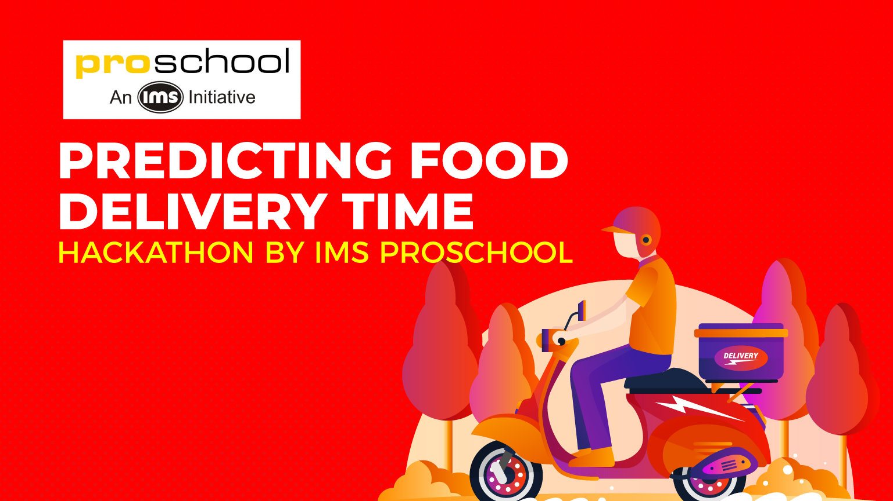

# Predicting Food Delivery Time - A Hackathon by IMS Pro School. - Machinehack.com

The entire world is transforming digitally and our relationship with technology has grown exponentially over the last few years. We have grown closer to technology, and it has made our life a lot easier by saving time and effort. Today everything is accessible with smartphones — from groceries to cooked food and from medicines to doctors. In this hackathon, we provide you with data that is a by-product as well as a thriving proof of this growing relationship. 

When was the last time you ordered food online? And how long did it take to reach you?

In this hackathon, we are providing you with data from thousands of restaurants in India regarding the time they take to deliver food for online order. As data scientists, your goal is to predict the online order delivery time based on the given factors.

Analytics India Magazine and IMS Proschool bring to you ‘Predicting Predicting Food Delivery Time Hackathon’.

Size of training set: 11,094 records

Size of test set: 2,774 records

FEATURES:

Restaurant: A unique ID that represents a restaurant.
Location: The location of the restaurant.
Cuisines: The cuisines offered by the restaurant.
Average_Cost: The average cost for one person/order.
Minimum_Order: The minimum order amount.
Rating: Customer rating for the restaurant.
Votes: The total number of customer votes for the restaurant.
Reviews: The number of customer reviews for the restaurant.
Delivery_Time: The order delivery time of the restaurant. (Target Classes) 
About IMS Proschool
IMS, since 1977, has worked towards building a long term successful career for its students. It emerged as the fourth most trusted education brands in an AC Nielsen and Brand Equity Survey. IMS Proschool is the extension of the same mission. Proschool helps individuals realize their potential by mentoring and imparting skills.

# Note

This Appoach gives you an accuracy of 82.5%.
**EXTENSIVE FE**
**LIGHTGBM**
**10 FOLD CV**

# Leaderboard (Nodus Tollens)

* **[Public LB](https://www.machinehack.com/course/predicting-food-delivery-time-hackathon-by-ims-proschool/leaderboard** : **44th/350 Rank**

(1.5K Participants)
